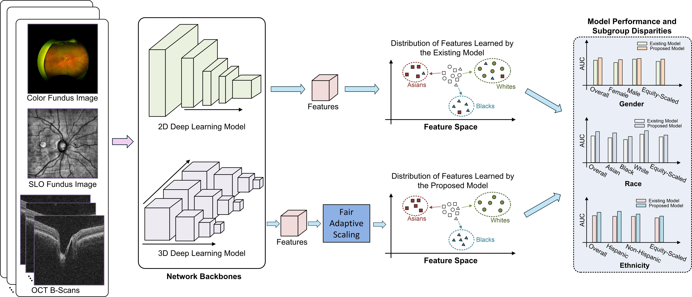

# FairAdaptiveScaling

The code for the paper entitled **Equitable deep learning for diabetic retinopathy detection using multi-dimensional retinal imaging with fair adaptive scaling**. If you have any questions, please email <harvardophai@gmail.com>.



# Dataset
The Harvard-FairVision dataset is available through [link](https://drive.google.com/drive/folders/1sLX2O_0AlrjY6JmdKijiV1zducsOsd0m?usp=sharing) and was used with approvals. The ODIR-5K dataset is publicly available at [link](https://www.kaggle.com/datasets/andrewmvd/ocular-disease-recognition-odir5k) 

The Harvard-FairVision30k DR related dataset has an approximate size of 383 GB. Upon downloading and extracting these datasets, you will find the dataset structure as follows.

```
Harvard-FairVision30k:
├── DR
│   ├── Training
│   ├── Validation
│   └── Test
├── data_summary_dr.csv
```
The "Training/Validation/Test" directories contain two types of data: SLO fundus photos and NPZ files that store OCT B-scans, SLO fundus photos, and additional attributes. SLO fundus photos serve visual inspection purposes, while the copies in NPZ files eliminate the need for the dataloader to access any other files except the NPZ files. The naming convention for SLO fundus photos follows the format "slo_xxxxx.jpg," and for NPZ files, it is "data_xxxxx.npz," where "xxxxx" (e.g., 07777) represents a unique numeric ID.

NPZ files have the following keys. 

In the DR disease, the NPZ files have
```
dr_subtype: DR conditions - {'not.in.icd.table', 'no.dr.diagnosis', 'mild.npdr', 'moderate.npdr', 'severe.npdr', 'pdr'}
oct_bscans: images of OCT B-scans
slo_fundus: image of SLO fundus
race: 0 - Asian, 1 - Black, 2 - White
male: 0 - Female, 1 - Male
hispanic: 0 - Non-Hispanic, 1 - Hispanic
maritalstatus: 0 - Married, 1 - Single, 2 - Divorced, 3 - Widowed, 4 - Leg-Sep
language: 0 - English, 1 - Spanish, 2 - Others
```
The condition would be converted into the label of vision-threatening DR by the condition-disease mapping.
```
condition_disease_mapping = {'not.in.icd.table': 0.,
                    'no.dr.diagnosis': 0.,
                    'mild.npdr': 0.,
                    'moderate.npdr': 0.,
                    'severe.npdr': 1.,
                    'pdr': 1.}
```

# Requirements

To install the prerequisites, run:

```
pip install - r requirements.txt
```

# Experiments

To run the experiments with the baseline models on 2D SLO fundus images, execute:
```
./scripts/train_dr_base.sh
```

To run the experiments with the baseline models with the proposed fair adaptive scalling module on 2D SLO fundus images, execute:
```
./scripts/train_dr_fair_fis.sh
```

To run the experiments with the baseline models on 3D OCT B-Scans, execute:
```
./scripts/train_dr_base_real3d.sh
```

To run the experiments with the baseline models with the proposed fair adaptive scalling module on 3D OCT B-Scans, execute:
```
./scripts/train_dr_base_real3d_fis.sh
```

## Acknowledgment and Citation

If you find this repository useful for your research, please consider citing our [paper](https://www.medrxiv.org/content/10.1101/2024.04.13.24305759v2.full.pdf):

```bibtex
@article{shi2024equitable,
  title={Equitable deep learning for diabetic retinopathy detection using multi-dimensional retinal imaging with fair adaptive scaling: a retrospective study},
  author={Shi, Min and Afzal, Muhammad Muneeb and Huang, Hao and Wen, Congcong and Luo, Yan and Khan, Muhammad Osama and Tian, Yu and Kim, Leo and Elze, Tobias and Fang, Yi and others},
  journal={medRxiv},
  pages={2024--04},
  year={2024},
  publisher={Cold Spring Harbor Laboratory Press}
}

```

# Licence

Apache License 2.0
